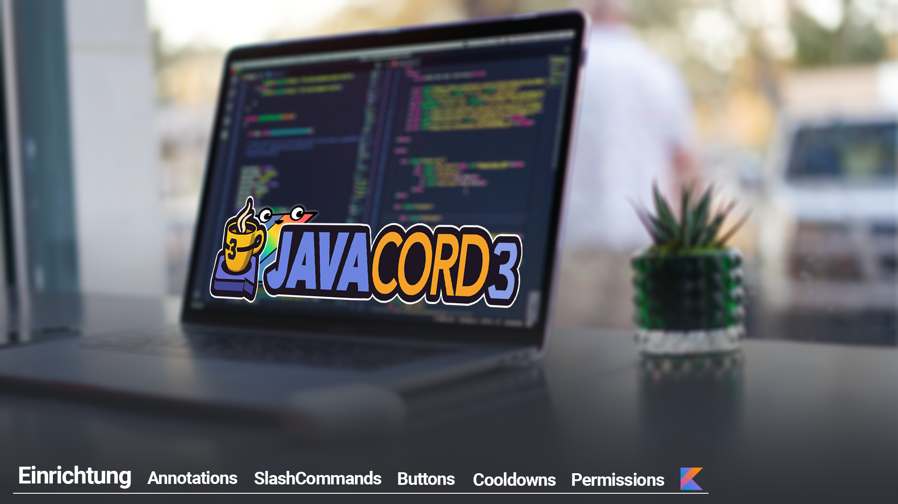

# JavacordKT_Tutorial    

## Folgen

- [x] Folge 1: Einrichtung »  [Download Zip](https://github.com/CoasterFreakDE/JavacordKT_Tutorial/releases/tag/Folge1) oder [Code ansehen](https://github.com/CoasterFreakDE/JavacordKT_Tutorial/tree/Folge1)
- [ ] Folge 2: Annotations
- [ ] Folge 3: SlashCommands
- [ ] Folge 4: Buttons
- [ ] Folge 5: Cooldowns
- [ ] Folge 6: Permissions

 
---
 

## Wichtige Links

- https://www.jetbrains.com/de-de/idea/
- https://kotlinlang.org/
- https://javacord.org/ bzw https://github.com/Javacord/Javacord

 

## Disclaimer

Du darfst alle Sourcecodes frei für deine Bots benutzen.
Es wäre cool, wenn du Melion.cloud irgendwo erwähnen oder den Server boosten würdest.
Invite zum Discord: https://discord.gg/melion

Lasse auch gerne ein Abo auf diesen Kanälen da:
- https://www.youtube.com/channel/UCDvHH-ATRjVX4dfOA-HZGNA/
- https://www.tiktok.com/@coasterfreakde?lang=de-DE